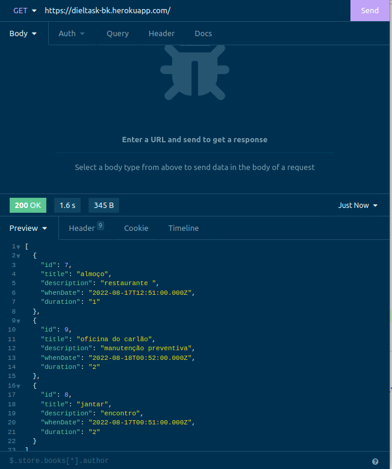
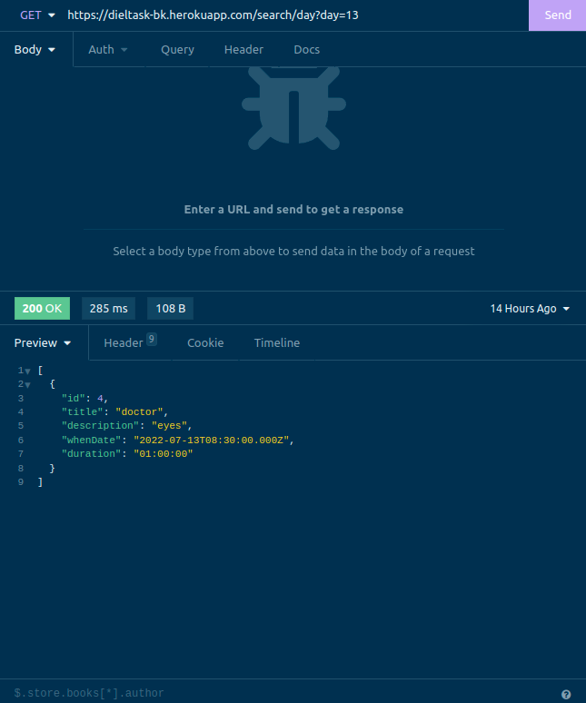
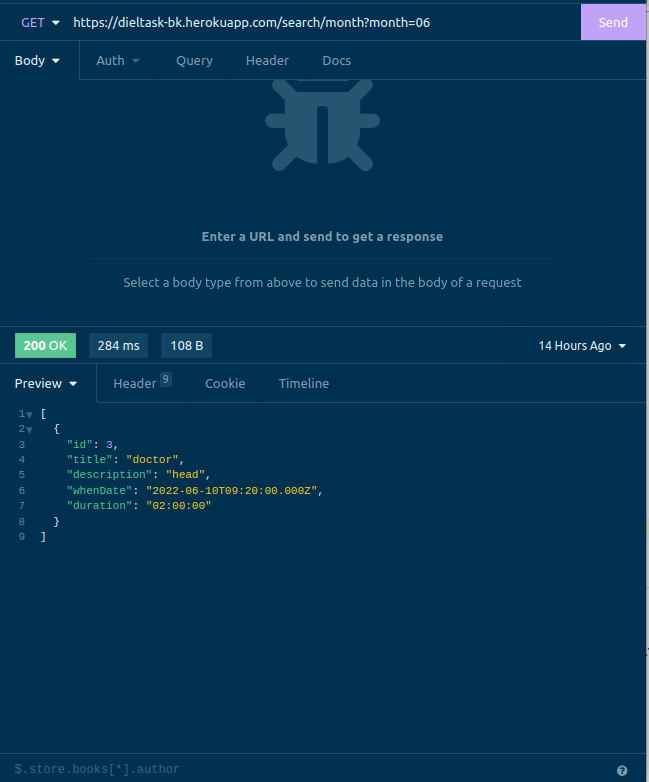
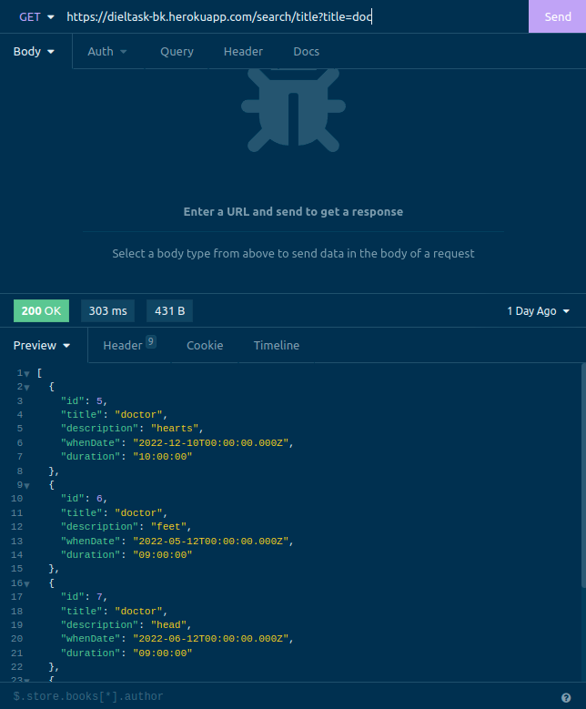
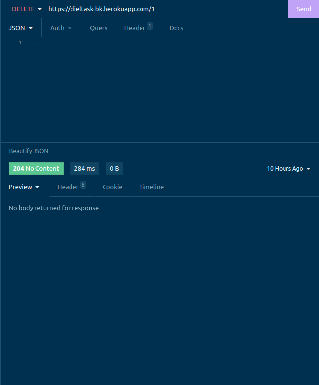
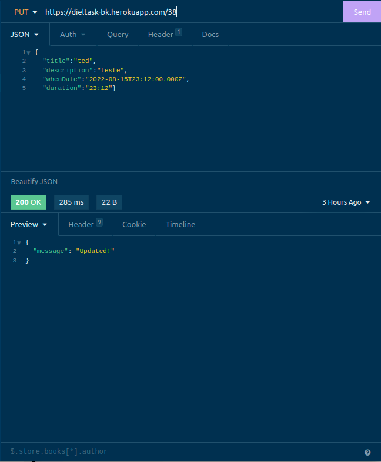
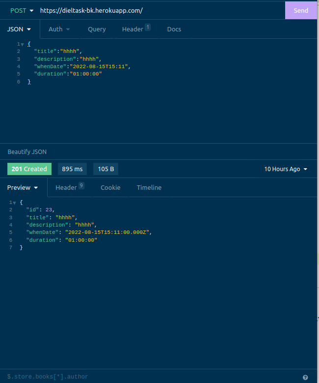

# Boas-vindas ao repositório do projeto Diel Task API!

Você pode acessar o deploy do projeto :point_right:	 [Diel Task API](https://dieltask-bk.herokuapp.com/).

   
<strong> :desktop_computer:	 HTTP Requests</strong>
 
   Páginas obrigatórias:
    LISTAR - GET.
    <h1 align="center"></h1>
    LISTAR - GET BY DAY.
        <h1 align="center"></h1>
        LISTAR - GET BY MONTH.
            <h1 align="center"></h1>
            LISTAR - GET BY TITLE.
                <h1 align="center"></h1>
                DELETAR - DELETE BY ID.
                    <h1 align="center"></h1>
                    ATUALIZAR - PUT BY ID.
                        <h1 align="center"></h1>
                        INSERIR - POST
                            <h1 align="center"></h1>
    

  
<strong>:keyboard:	 Acessando projeto localmente </strong>
 

 1. Clone o repositório

 2. Instale as dependências com `npm install`
 
 3. Execute o NPM START
 

  
<strong>:keyboard:	 API Utilizada </strong>
 
Repositorio: https://github.com/lsbluu/dielTaskApi  
Heroku: https://dieltask-bk.herokuapp.com/

